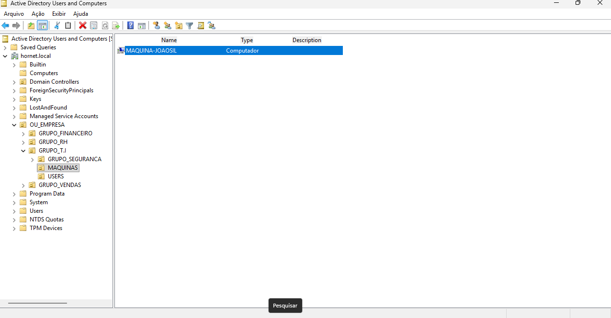
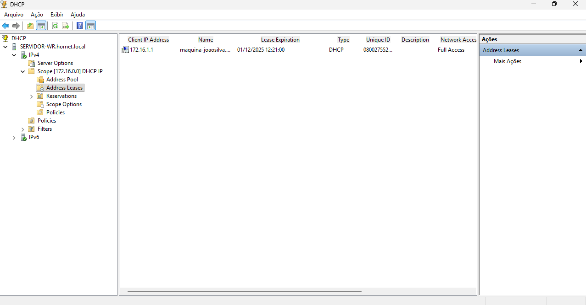
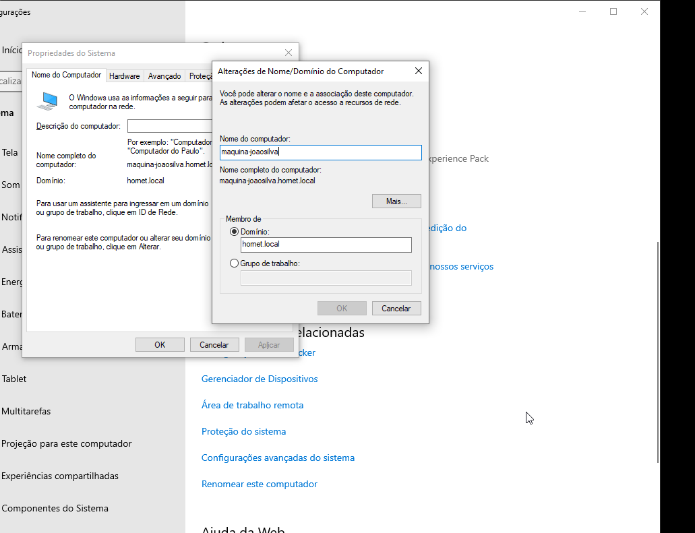

# Laboratório Windows Server – Active Directory + DHCP

Implementação de um ambiente Windows Server voltado para estudos e simulação de um cenário corporativo, incluindo **Active Directory Domain Services**, **DHCP Server**, e uma **estrutura organizada de OUs**.

---

## Estrutura Implementada

---

## DHCP Server

- **Servidor:** `SERVER-WR.hornet.local`
- **Escopo IPv4:** `172.16.0.0`
- **Lease ativo:**
  - Máquina: **maquina-joaosilva**
  - IP: `172.16.1.1`
  - Expiração: **01/12/2025 12:21:00**
- **Address Pool** configurado
- **Reservations** habilitadas para IPs fixos
- Integração com DNS e AD para atualização dinâmica

---

## Active Directory – Estrutura de OUs

**Domínio:** `hornet.local`

### OU Principal  
`OU_EMPRESA`

### Subdivisões por departamento
- **GRUPO_FINANCEIRO** — Setor financeiro
- **GRUPO_RH** — Recursos Humanos
- **GRUPO_T.I** — Tecnologia da Informação  
- **GRUPO_VENDAS** — Setor de vendas

- Em cada pasta do setor contém
 - **GRUPO_SEGURANCA** — Segurança 
  - **MAQUINAS** — Computadores do setor  
  - **USERS** — Usuários 
---

## Computadores Registrados

- **MAQUINA-JOAOSIL** - VirtualBox Windows 10
  - Tipo: Computador
  - Registro no AD
  - Integrada ao domínio
  - Recebendo IP via DHCP automaticamente

---

## Características do Ambiente

- Estrutura hierárquica organizada para futura aplicação de **GPOs por setor**
- Gerenciamento centralizado de usuários e computadores
- Separação de grupos por função e responsabilidade
- DHCP integrado ao AD com registro DNS automático
- Ambiente simulando estrutura corporativa com múltiplos departamentos

---

## Screenshots

